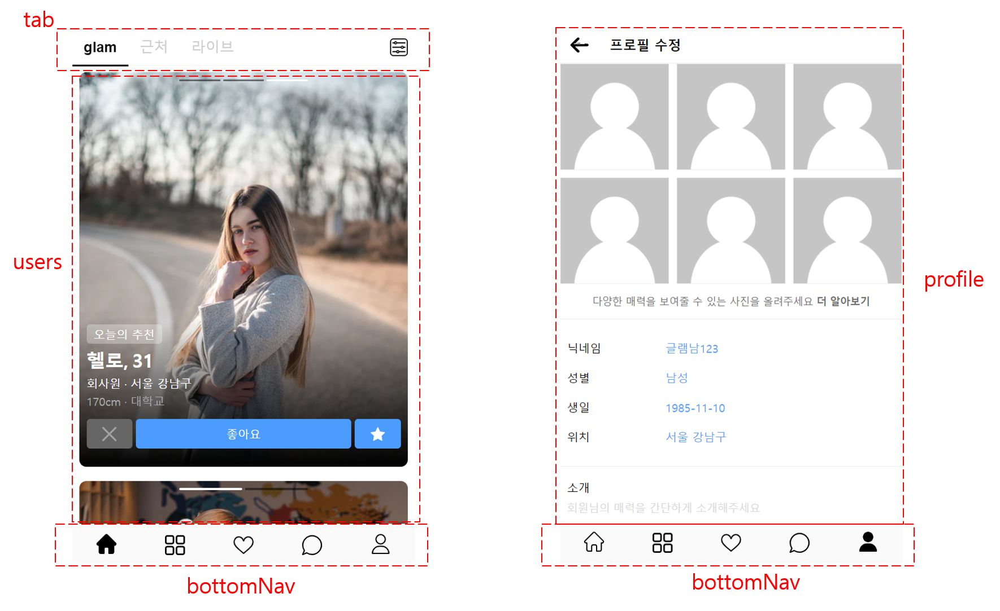

#### 1. 프로젝트 소개

글램 어플의 일부 화면 및 기능을 가진 웹 앱입니다.
(라이브 데모)[]


#### 2. 실행

```shell
npm i
npm start
```


#### 3. 폴더구조 및 화면

```bash
`-- src
    |-- App.tsx
    |-- assets
    |   |-- dummydata
    |   `-- images
    |-- components
    |   |-- BottomNav
    |   |-- common
    |   |-- layout
    |   |-- profile
    |   |-- tab
    |   `-- users
    |-- index.scss
    |-- index.tsx
    |-- interfaces
    |-- pages
    `-- redux
```

> `index.tsx`  앱 시작 파일
>
> `index.scss`  전역 스타일 정의
>
> `App.tsx`  페이지 정의; 전체 레이아웃과 컴포넌트들을 사용
>
> `components/bottomNav`  하단 네비게이션 메뉴 
>
> `components/common`   공통으로 사용하는 컴포넌트들; 예: 버튼, 다이어로그 등
>
> `components/layout` 레이아웃 컴포넌트
>
> `components/profile`  프로필 화면
>
> `components/tab`  홈 화면 상단 탭
>
> `components/users`  홈 화면 이성 유저들의 리스트
>
> `redux`   리덕스 설정 및 상태관리 리듀서들 정의



#### 4. 기타

- 일부 아이콘들은 최적화를 위해 이미지 스프라이트를 적용하였습니다.

- 홈 화면은 컴포넌트 내부에서 상태를 관리합니다.

- 홈 화면은 css라이브러리를 사용하지 않았습니다.

- 프로필 화면은 리덕스를 통해서 상태를 관리합니다:`redux-toolkit` `redux-persist`

- 프로필 화면의 Dialog들은 `material-ui`를 사용하였습니다.
